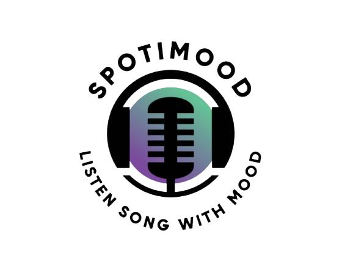

# 🎵 Spotimood

**A mood-based music playlist generator that creates personalized playlists using AI-powered mood analysis.**

Spotimood combines your current emotional state with intelligent music curation to deliver the perfect soundtrack for any moment. Whether you're feeling energetic, relaxed, melancholic, or euphoric, Spotimood understands your vibe and curates YouTube music playlists that match your mood perfectly.



## ✨ Features

### 🎭 **Intelligent Mood Analysis**
- Interactive mood questionnaire powered by Google Gemini AI
- Contextual questions that understand nuanced emotional states
- Smart mood scoring and categorization
- Mood history tracking and trends analysis

### 🎵 **AI-Powered Playlist Generation**
- Personalized playlist creation based on mood analysis
- Integration with YouTube's vast music library
- Genre-aware music curation
- Seamless music discovery and playback

### 👤 **User Management & Authentication**
- Secure user authentication with Supabase Auth
- Email/password and social login (Google, GitHub)
- User profiles with mood history
- Row Level Security for data privacy

### 📱 **Playlist Management**
- Create, edit, and organize custom playlists
- Add/remove songs from playlists
- Drag-and-drop playlist reordering
- Public/private playlist settings

### 🔍 **Music Search & Discovery**
- Real-time YouTube music search
- Advanced filtering and sorting
- Song previews and metadata
- Artist and album information

### 💬 **Community & Feedback**
- User feedback system with ratings
- Bug reports and feature requests
- Community-driven improvements

## 🛠️ Tech Stack

### **Frontend**
- **React 18** - Modern UI library with hooks
- **Vite** - Lightning-fast build tool and dev server
- **React Router** - Client-side routing
- **Tailwind CSS** - Utility-first CSS framework
- **Lucide React** - Beautiful icon library

### **Backend & Database**
- **Supabase** - Backend-as-a-Service platform
  - PostgreSQL database with real-time subscriptions
  - Authentication & user management
  - Row Level Security (RLS)
  - Auto-generated REST APIs

### **APIs & Services**
- **YouTube Data API v3** - Music search and metadata
- **Google Gemini AI** - Mood analysis and playlist generation
- **Supabase Auth** - Authentication flows

### **State Management**
- **React Context API** - Global state management
- **Custom hooks** - Reusable stateful logic
- **Local Storage** - Client-side data persistence

## 🚀 Getting Started

### Prerequisites
- Node.js 18+ and npm
- Supabase account
- YouTube Data API key
- Google Gemini API key

### Installation

1. **Clone the repository**
   ```bash
   git clone https://github.com/yourusername/spotimood.git
   cd spotimood
   ```

2. **Install dependencies**
   ```bash
   npm install
   ```

3. **Set up environment variables**
   
   Create a `.env` file in the root directory:
   ```env
   # Supabase Configuration
   VITE_SUPABASE_URL=your_supabase_project_url
   VITE_SUPABASE_ANON_KEY=your_supabase_anon_key
   ```

   Create a `.env` file in the `server` directory:
   ```env
   # API Keys
   YOUTUBE_API_KEY=your_youtube_api_key
   GEMINI_API_KEY=your_gemini_api_key
   PORT=3001
   ```

4. **Set up Supabase database**
   
   Run the SQL schema in your Supabase SQL Editor (see `database-schema.sql` for the complete schema).

5. **Configure authentication providers**
   
   In your Supabase dashboard:
   - Go to Authentication → Providers
   - Enable Email, Google, and GitHub providers
   - Set redirect URLs: `http://localhost:5173/auth/callback`

6. **Start the development servers**
   
   Frontend:
   ```bash
   npm run dev
   ```
   
   Backend:
   ```bash
   cd server
   npm start
   ```

7. **Open your browser**
   
   Navigate to `http://localhost:5173`

## 📁 Project Structure

```
spotimood/
├── src/
│   ├── components/
│   │   ├── Layout/          # Header, Sidebar, Navigation
│   │   ├── pages/           # Main page components
│   │   ├── mood/            # Mood questionnaire components
│   │   ├── MusicPlayer/     # Audio playback controls
│   │   ├── cards/           # Playlist and album cards
│   │   ├── forms/           # Form components
│   │   └── UI/              # Reusable UI components
│   ├── context/             # React Context providers
│   ├── hooks/               # Custom React hooks
│   ├── lib/                 # Utility libraries (Supabase client)
│   └── api/                 # API service functions
├── server/                  # Express.js backend
├── public/                  # Static assets
└── database-schema.sql      # Supabase database schema
```

## 🎯 Key Features in Detail

### Mood Analysis Workflow
1. User completes interactive mood questionnaire
2. Responses are analyzed using Google Gemini AI
3. Mood score and description are generated
4. Personalized playlist is created based on analysis
5. User can save, modify, or regenerate playlists

### Authentication Flow
1. Users can sign up/sign in with email or social providers
2. Supabase handles secure authentication and session management
3. Row Level Security ensures users only access their own data
4. Authentication state is managed globally via React Context

### Music Integration
1. YouTube Data API provides music search and metadata
2. Custom YouTube player component handles playback
3. Playlists are stored in Supabase with song references
4. Real-time updates across all user sessions

## 🔒 Security & Privacy

- **Row Level Security (RLS)** - Database-level access control
- **JWT Authentication** - Secure token-based authentication
- **Environment Variables** - Sensitive data protection
- **Input Validation** - Client and server-side validation
- **CORS Configuration** - Controlled cross-origin requests

## 🌟 Contributing

We welcome contributions! Please see our contributing guidelines:

1. Fork the repository
2. Create a feature branch (`git checkout -b feature/amazing-feature`)
3. Commit your changes (`git commit -m 'Add amazing feature'`)
4. Push to the branch (`git push origin feature/amazing-feature`)
5. Open a Pull Request

## 📄 License

This project is licensed under the MIT License - see the [LICENSE](LICENSE) file for details.

## 🙏 Acknowledgments

- **Supabase** - Amazing backend-as-a-service platform
- **YouTube** - Extensive music library and API
- **Google Gemini** - Powerful AI for mood analysis
- **Tailwind CSS** - Beautiful and responsive design system
- **React Team** - Incredible frontend framework

## 📞 Support

If you have any questions or need help:

- 📧 Email: support@spotimood.com
- 🐛 Issues: [GitHub Issues](https://github.com/yourusername/spotimood/issues)
- 💬 Discussions: [GitHub Discussions](https://github.com/yourusername/spotimood/discussions)

---

**Built with ❤️ by the Spotimood Team**
